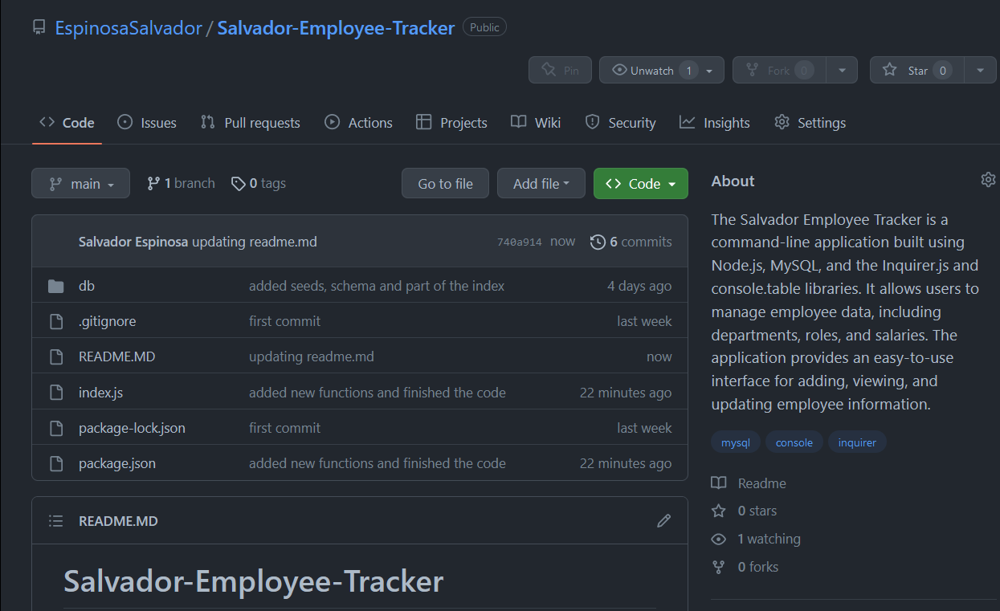
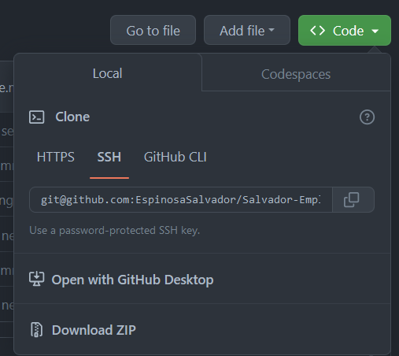
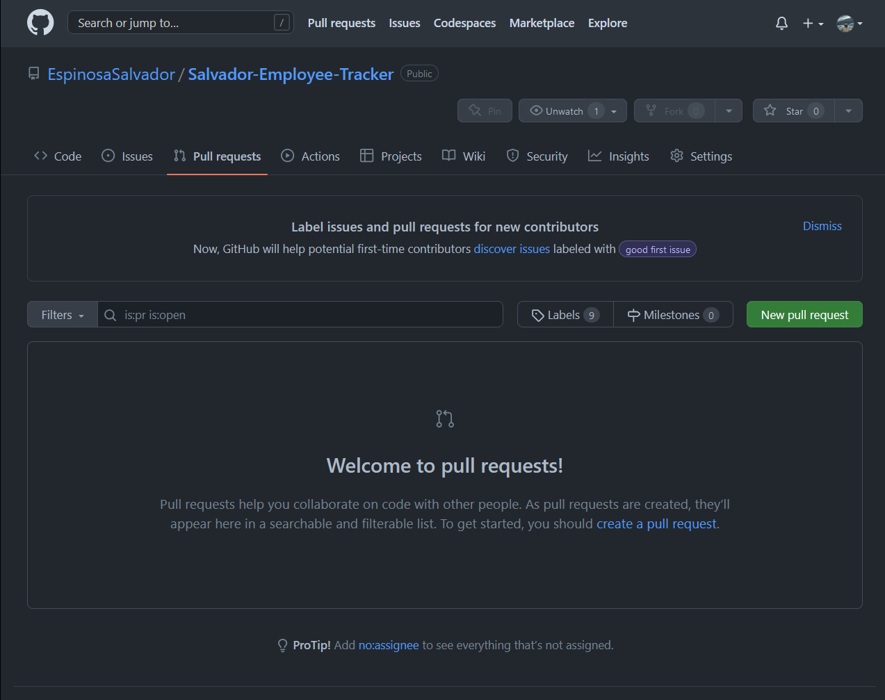
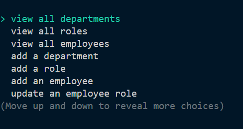
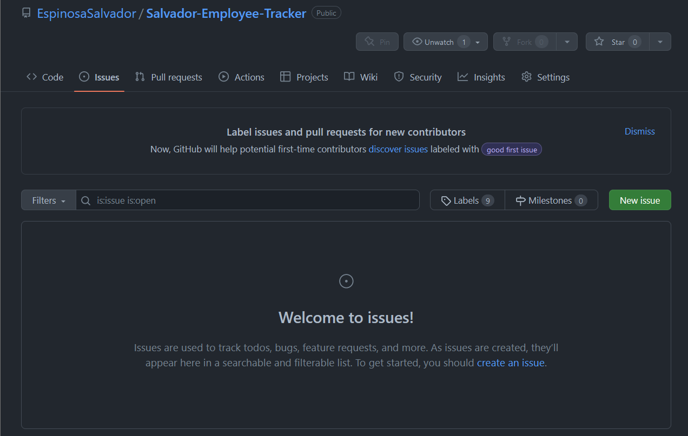

# Salvador-Employee-Tracker

## Table of Content

* [Introduction](#introduction)
* [Features](#features)
* [Requirements](#requirements)
* [Installation](#installation)
* [Configuration](#configuration)
* [What you should be able to see](#what-you-should-be-able-to-see)
* [Troubleshooting](#troubleshooting)
* [Next Phase Development](#next-phase-development)
* [FAQ (Frecuently Asked Questions)](#faq-frecuentrly-asked-questions)
* [Team](#team)

## Introduction

Welcome to the Employee-tracker application. this application allows users to write, save, update, and create new information for the tables in MYSQL.

[Link to my Github Repository](https://github.com/EspinosaSalvador/Salvador-Employee-Tracker)

## Features

This app is a command-line interface (CLI) program for managing employee data in a MySQL database. The following are the features of this app:

* View all departments: This feature allows the user to view a table of all the departments in the company.
* View all roles: This feature allows the user to view a table of all the job roles in the company.
* View all employees: This feature allows the user to view a table of all the employees in the company.
* Add a department: This feature allows the user to add a new department to the database.
* Add a role: This feature allows the user to add a new job role to the database.
* Add an employee: This feature allows the user to add a new employee to the database.
* Update an employee role: This feature allows the user to update the job role of an existing employee.
* Exit: This feature allows the user to exit the application.

## Requirements

* Node.js installed on the system
* console.table package version 0.10.0 or higher installed
* inquirer package version 8.2.4 or higher installed
* mysql2 package version 3.2.1 or higher installed

## Installation

To install this project please proceed to my [GitHub Repository](https://github.com/EspinosaSalvador/Salvador-Employee-Tracker)

you should be able to see this,



Click on code as shown in the image



Copy the SSH key or the HTTPS key and open.

* Terminal
* Git bash
* CMD

either one of this will work. please proceed to the terminal an put in your Terminal,

```
git clone git@github.com:EspinosaSalvador/Salvador-Employee-Tracker.git
```

and now you have a copy of the code.

you can work/play/use the app

## Configuration

If you want to do any configurations on this project please open a new branch you can do this by putting the following code in your terminal,

```
git checkout -b ＜new-branch＞
```

switch branches putting the following code on your terminal.

```
git checkout ＜branchname＞
```

If you want to show us your code and merge please open a pull request on

[Github](https://github.com/EspinosaSalvador/Salvador-Employee-Tracker/pulls).



## What you should be able to see

To start this app please use npm start in the command line or your terminal. after that you should be able to see this



I am going to show you some basic commands that we are using for example lest start with "view all departments".


the image above show us a table showing us the follwing on its rows:

* id
* name

to continue lets look at the table from roles. here is the way that is looking as in version 1.00.

we are able to see:

* id
* title
* salary
* department_id.


when we click on view all employees you should be able to see this.

you should see the following rows in the table:

* id
* first_name
* last_name
* role_id
* manager_id


and if you wish to add departments this is what you should be able to see. 

just type the name of the department that you wish.


and repeat the same process with add role and add employee. just follow the instructions and see what the command line is asking you to do.

## Troubleshooting

The Employee-Tracker is in version 1.0, please let me know if there are anybug in the webpage by issuing it in [Github](https://github.com/EspinosaSalvador/Salvador-Employee-Tracker/issues)



## Next Phase Development

This are will be updated depending on the feedback from the users.

## FAQ (Frecuentrly Asked Questions)

We will update this part when we have some frequently asked question.

## Team

* Salvador Espinosa Valdez
